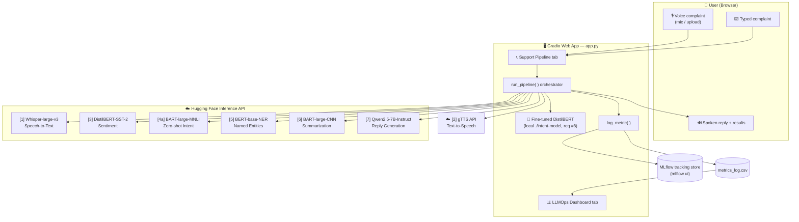
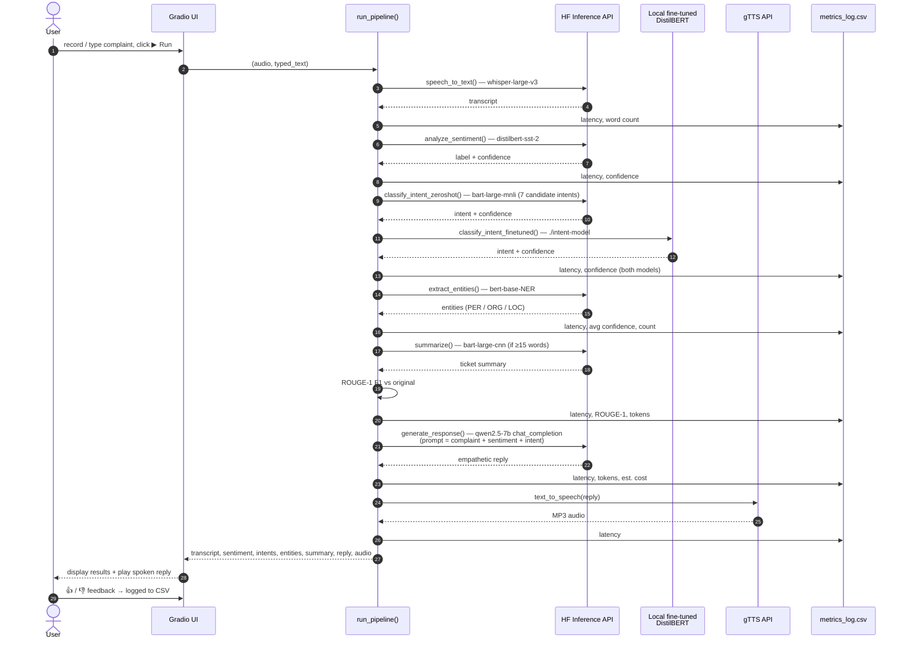

# 🎧 VoiceDesk AI — API-driven Customer Support Assistant

**CCZG506 Assignment II** · Domain: **Customer Service** · Categories: **NLP + Speech Recognition**

A customer records (or types) a complaint. The system transcribes it, detects sentiment,
classifies intent (zero-shot **and** with our fine-tuned model), extracts entities,
summarises the ticket for a human agent, drafts an empathetic reply with an LLM, and
speaks the reply back — while logging LLMOps metrics for every API call.

## Architecture

### High-Level Design (HLD)



### Low-Level Design (LLD)



## Sub-tasks implemented (7)

| # | Sub-task | Category | Model / API | API method |
|---|---|---|---|---|
| 1 | Speech-to-Text | Speech Recognition | `openai/whisper-large-v3` (HF Inference API) | `automatic_speech_recognition` |
| 2 | Text-to-Speech | Speech Recognition | gTTS (Google Text-to-Speech API) | `gTTS().save()` |
| 3 | Sentiment Analysis | NLP | `distilbert/distilbert-base-uncased-finetuned-sst-2-english` (HF) | `text_classification` |
| 4 | Intent Classification | NLP | `facebook/bart-large-mnli` (zero-shot, HF) **+** our fine-tuned DistilBERT | `zero_shot_classification` + local pipeline |
| 5 | Named Entity Recognition | NLP | `dslim/bert-base-NER` (HF) | `token_classification` |
| 6 | Summarization | NLP | `facebook/bart-large-cnn` (HF) | `summarization` |
| 7 | Response Generation | NLP | `Qwen/Qwen2.5-7B-Instruct` (HF router, OpenAI-style chat) | `chat_completion` |

### 1. Speech-to-Text (`speech_to_text`)
Converts the customer's recorded/uploaded voice complaint into text using Whisper-large-v3
over the Hugging Face Inference API. **Input:** audio file (microphone or upload) →
**Output:** transcript string that feeds every downstream NLP sub-task.
**Metrics logged:** latency, word count, character count.

### 2. Text-to-Speech (`text_to_speech`)
Speaks the AI-generated reply back to the customer using the gTTS API (first 500 chars),
saving an MP3 that plays in the browser. **Input:** reply text → **Output:** MP3 audio.
**Metrics logged:** latency, word count.

### 3. Sentiment Analysis (`analyze_sentiment`)
Classifies the complaint as POSITIVE/NEGATIVE with a confidence score using DistilBERT
fine-tuned on SST-2. The detected sentiment is also injected into the reply-generation
prompt so the LLM can match its tone to the customer's mood.
**Metrics logged:** latency, confidence.

### 4. Intent Classification (`classify_intent_zeroshot` + `classify_intent_finetuned`)
Two models run side by side on every complaint — a strong comparison point:
- **Zero-shot baseline:** BART-large-MNLI scores the complaint against 7 candidate intents
  (refund request, cancel order, delivery problem, payment issue, product complaint,
  account help, general enquiry) with no training.
- **Our fine-tuned model (requirement #8):** DistilBERT fine-tuned on the Bitext Customer
  Support dataset (~27k utterances, 27 intents), loaded from `./intent-model`.

The UI shows both predictions with confidences so zero-shot vs fine-tuned quality is
directly visible. **Metrics logged:** latency and confidence for each model separately.

### 5. Named Entity Recognition (`extract_entities`)
Extracts people, organisations, and locations (e.g. *Priya=PER, Chennai=LOC*) from the
complaint using BERT-base-NER, giving the human agent structured ticket fields.
**Metrics logged:** latency, average entity confidence, entity count.

### 6. Summarization (`summarize`)
Condenses long complaints into a short ticket summary for the human agent using
BART-large-CNN (complaints under 15 words are passed through unchanged). Summary quality
is scored automatically with **ROUGE-1 F1** against the original complaint.
**Metrics logged:** latency, ROUGE-1 F1, summary token count.

### 7. Response Generation (`generate_response`)
Drafts a short, empathetic, professional reply (≤120 words) with a concrete next step
using Qwen2.5-7B-Instruct via the HF router's OpenAI-compatible chat API. The prompt is
grounded with the outputs of sub-tasks 3 and 4 (sentiment + detected intent).
**Metrics logged:** latency, total tokens, estimated cost (USD).

## Setup (5 minutes)

1. Get a free Hugging Face token: https://huggingface.co/settings/tokens (Read access).
2. ```bash
   pip3 install -r requirements.txt
   export HF_TOKEN=hf_xxxxxxxxxxxx      # Windows: set HF_TOKEN=hf_xxx
   python3 app.py
   ```
3. Open the local Gradio URL it prints.

## Fine-tuning (requirement #8)

Open Google Colab (free T4 GPU), upload `finetune_intent.py`, then:

```
!pip install -q transformers datasets evaluate accelerate scikit-learn
!python finetune_intent.py
!zip -r intent-model.zip intent-model
```

Download `intent-model.zip`, unzip it **next to `app.py`**. The app now shows
zero-shot vs fine-tuned intent predictions side by side — a strong demo/viva point.
The script prints test **accuracy** and **macro-F1**; quote them in the report.

- Base model: DistilBERT (SLM, 66M params)
- Dataset: Bitext Customer Support (~27k utterances, 27 intents) — same domain ✔

## LLMOps — metrics measured (≥5 required)

| Metric | Where |
|---|---|
| 1. Latency per sub-task | every API call, logged to CSV |
| 2. Model confidence (sentiment / intent / NER) | logged per call |
| 3. Intent quality: fine-tuned accuracy & macro-F1 vs zero-shot | finetune script + live comparison |
| 4. Summary quality (ROUGE-1 F1) | logged per summary |
| 5. Token usage & estimated cost | logged per LLM call |
| 6. User satisfaction (👍/👎 feedback) | in-app rating |

View them in the **📊 LLMOps Dashboard** tab (aggregated from `metrics_log.csv`).

### MLflow experiment tracking

Every metric is **also mirrored to MLflow** (industry-standard LLMOps tooling):

- **`voicedesk-ai` experiment** — one MLflow run per pipeline execution, with
  per-sub-task latency/confidence/token metrics, input-mode & transcript-length
  params, and one run per 👍/👎 feedback event.
- **`voicedesk-intent-finetune` experiment** — one run per fine-tuning job
  (`finetune_intent.py`) logging hyperparameters (base model, dataset, epochs,
  learning rate, batch size) and final test accuracy / macro-F1 / loss.

Browse both at http://localhost:5000 by running **from the project folder**:

```bash
mlflow ui --backend-store-uri sqlite:///mlflow.db
```

(The `--backend-store-uri` flag matters: runs are logged to `mlflow.db`, and a
plain `mlflow ui` would serve an empty `./mlruns` store instead.)

MLflow is optional at runtime — if it isn't installed the app falls back to
CSV-only logging.

## Suggested demo flow (viva)

1. Record: *"Hi, this is Priya. My order 4521 from Chennai arrived damaged and I want a refund."*
2. Show transcript → sentiment (NEGATIVE) → intents (both models agree: refund) →
   entities (Priya=PER, Chennai=LOC) → summary → generated reply → play TTS audio.
3. Rate the reply 👍, open the Dashboard tab, hit refresh → show live metrics.
4. Explain the fine-tuning notebook output (accuracy/F1) and why an SLM was chosen.

## Rubric mapping

| Assignment requirement | Where satisfied |
|---|---|
| Domain | Customer Service |
| Two categories | NLP + Speech Recognition |
| ≥5 sub-tasks | 7 sub-tasks (see architecture) |
| LLM/SLM models via APIs | Hugging Face Inference API (Whisper, DistilBERT, BART, Qwen2.5) + gTTS |
| Cohesive unified objective | One end-to-end support-ticket pipeline |
| Interactive & demonstrable | Gradio web app |
| LLMOps, ≥5 metrics | 6 metrics + in-app dashboard + MLflow experiment tracking |
| Fine-tune on same-domain dataset | DistilBERT on Bitext Customer Support |
